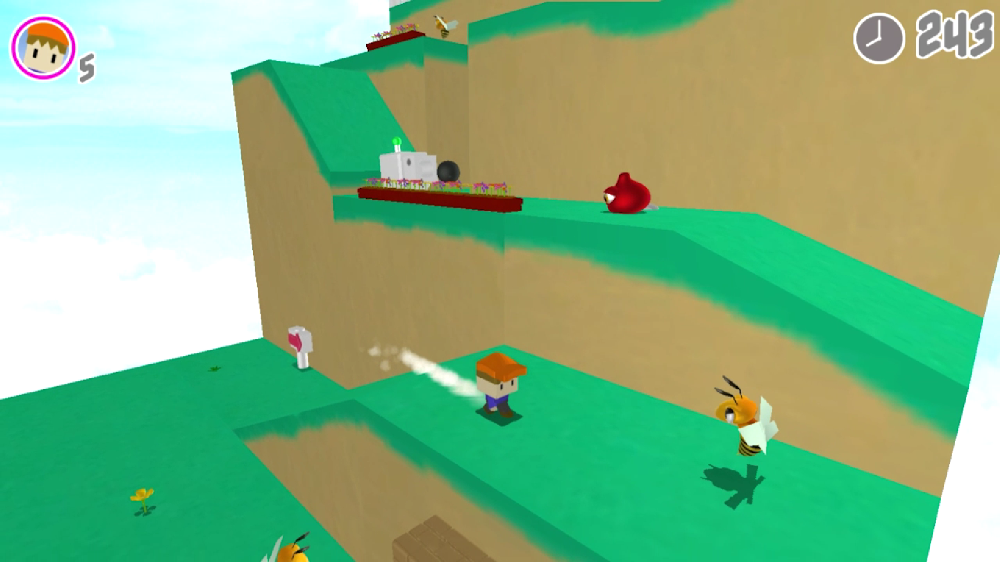

<h1> スーパーアクション3D<h1>
河原電子ビジネス専門学校 
ゲームクリエイター科　2年　田村響己 

<!-- omit in toc -->
# 目次
  <!-- omit in toc -->
- [1. 作品概要](#1-作品概要)
- [2. 操作説明](#2-操作説明)
- [3. ゲーム内容](#3-ゲーム内容)
- [4. こだわり・工夫した部分](#4-こだわり工夫した部分)

# 1. 作品概要

<iframe width="560" height="315" src="https://www.youtube.com/embed/2Plp1csDpuQ" title="YouTube video player" frameborder="0" allow="accelerometer; autoplay; clipboard-write; encrypted-media; gyroscope; picture-in-picture; web-share" allowfullscreen></iframe>

## タイトル
## _スーパーアクション３D_ 
## ゲームジャンル
アクションゲーム
## 参考ゲーム
スーパーマリオ3Dワールド 
## 使用エンジン 
学校内製の簡易エンジンを改造(DirectX12) 
## 開発環境
Windows10 
DirectX12 
## 使用言語
C++ 
HLSL 
## 使用ツール
### ・プログラム
Visual Studio 2019 
### ・モデル
3ds Max  
blender 
### ・画像
Adobe Photoshop 
### ・エフェクト
Effekseer 
### ・グラフィックデバッグ
RenderDoc 
### ・バージョン管理
Github 
### ・スケジュール管理
Notion 
## 作成したソースコード
##

ゲーム部分(cpp,h)

Bard.cpp 
Bard.h 
Bg.cpp 
Bg.h 
Block.cpp 
Block.h 
Box.cpp 
Box.h 
Bush.cpp 
Bush.h 
Default.cpp 
Default.h 
Dokan.cpp 
Dokan.h 
Enemy_Green.cpp 
Enemy_Green.h 
Enemy_Red.cpp 
Enemy_Red.h 
Enemy_Yellow.cpp 
Enemy_Yellow.h 
Fade.cpp 
Fade.h 
Fence.cpp 
Fence.h 
Fence2.cpp 
Fence2.h 
Flower.cpp 
Flower.h 
FlowerBed.cpp 
FlowerBed.h 
Fort.cpp 
FOrt.h 
Forward.cpp 
Forward.h 
Game.cpp 
Game.h 
GameCamera.cpp 
GameCamera.h 
GoalPoint.cpp 
GoalPoint.h 
Grass.cpp 
Geass.h 
GroundMove.cpp 
GroundMove.h 
HitBox.cpp 
main.cpp 
Pebble.cpp 
Pebble.h 
Player.cpp 
Player.h 
Player_Hed.cpp 
Player_Hed.h 
Rock_Attack.cpp 
Rock_Attack.h.h 
Rock_Big.cpp 
Rock_Big.h 
SignBoard.cpp 
SignBoard.h 
Stairs.cpp 
Stairs.h 
Title.cpp 
Title.h 
Tree.cpp 
Tree.h 
Windmill.cpp 
Windmill.h 
Wood_Road.cpp 
Wood_Rock.h 
WoodenBox.cpp 
WoodenBox.h 

##

エンジン部分(cpp,h)

Bloom.h 
Bloom.cpp 
CollisionObject.h 
CollisionObject.cpp 
FontRender.h 
FontRender.cpp 
IRenderer.h 
IRenderer.cpp 
LightALL.h 
LightALL.cpp 
ModelRender.h 
ModelRender.cpp 
PostEffect.h 
PostEffect.cpp 
RenderingEngine.h 
RenderingEngine.cpp 
ShadowMapRender.h 
ShadowMapRender.cpp 
SkyCube.h 
SkyCubr.cpp 
SpriteRender.h 
SpriteRender.cpp 

##

シェーダー部分(fx,h)

DrawShadowMap.fx 
gaussianBlur.fx 
light.fx 
model.fx 
ModelVSCommon.h 
PostEffect.fx 
SkyCubeMap.fx 
sprite.fx 
ZPrepass.fx 

## 制作人数
1人
## 開発期間
2022年10月～現在
# 2. 操作説明

# 3. ゲーム内容
## ゲームの流れ
少年を操作し、ゴールにある宝石を手に入れよう。 

__ゲームクリア__ 
ゴールにある宝石を手に入れるとゲームクリアです。 

__ゲームオーバー__ 
左上に表示されている残機が０になるか、右上に表示されている制限時間が０になるとゲームオーバーです。 
残機は、敵に倒されるかステージ外に落ちると１ずつ減っていきます。 
残機が減った場合、規定の位置に戻ります。 

# 4. こだわり・工夫した部分

## 操作
### 待機
様々な既存のゲームで操作をせずにしていると、キャラクター独自のモーションに変化することを参考にしました。 
一定時間操作していないと待機モーションが変化するようにしました。 

<video controls preload width="780" autoplay loop muted="true" poster="">
<source src="Idle.mp4"type="video/mp4">
</video>

### 移動

Lスティック＋ダッシュボタンでプレイヤーがダッシュします。 
一定時間ダッシュし続けるとスーパーダッシュに変化します。 
通常ダッシュとスーパーダッシュでは、速度が異なります。 
通常ダッシュでは超えられない場所も、スーパーダッシュで超えることが出来ます。 

歩き、ダッシュ、スーパーダッシュの差別化 

<video controls preload width="780" autoplay loop muted="true" poster="">
<source src="jump.mp4"type="video/mp4">
</video>

マリオはジャンプした時の軌道が放物線にならないのが特徴的です。これは、上昇速度と下降速度が異なるからです。 

そこで、上昇中の重力を弱くし、下降中の重力を強くすることで、再現しました。 

__ヒップドロップ__ 
空中でヒップドロップボタンを入力でプレイヤーがヒップドロップします。 
敵を倒す、ブロックを破壊する用途の他に、素早く真下に着地することが出来ます。 
ヒップドロップ中はLスティックの操作は効かないようにしています。 
アニメーションイベントを利用して、回転中は重力を０に、回転後は強い重力を与えています。 

*問題点と解決* 
しかし、ヒップドロップで敵を倒そうとすると、プレイヤーの落下速度が速すぎて敵を倒せていても敵の攻撃判定に衝突し相打ちしてしまう（敵が倒れる時に敵の攻撃判定も消える為)ので、ヒップドロップ落下中は無敵にする事にしました。 

ですが、無敵にしてしまうと全ての敵を安全に倒せるようになってしまうと考え、着地してから再度動けるようになる時間を長めに設定しました。 
これにより、目の前の敵に対してヒップドロップを外す、または別の敵に攻撃されるリスクを付けバランスを調整しました。 

<video controls preload width="780" autoplay loop muted="true" poster="">
<source src="hipdrop.mp4"type="video/mp4">
</video>

## ステージ
### 背景
プレイヤーのモデルに合わせて、ローポリゴンで作成しました。 
画面に動きが欲しかったので、所々の背景モデルにアニメーションを追加しました。 

 

<video controls preload width="780" autoplay loop muted="true" poster="">
<source src="stage.mp4"type="video/mp4">
</video>

## 敵
### スライム（追いかけてくる敵）
 
プレイヤーを見つけると地面を素早く跳ねて追いかけてきます。（XZ軸移動） 
段差を降りることは出来ますが登るのことは出来ません。 

### ハチ（飛んで追いかけてくる敵)
 
プレイヤーが近づくと追いかけてくるように移動します。（XYZ軸移動） 
スライムとは違い、飛んで追いかけてくるためY軸も移動させるようにしました。 
スライムと違い段差を無視出来ますが、ダッシュで逃げ切れるほど移動速度が遅くなっています。 
プレイヤーと全く同じ高さで追いかけてくると踏んで倒しにくいため、プレイヤーの少し下を追いかけてくるようにしています。 

### ロボット（遠距離攻撃を行う敵）
 
砲弾を発射し攻撃してくる遠距離エネミーです。  
本体に攻撃判定はありませんが、ジャンプでは倒せずヒップドロップを使う必要があります。 
また、砲弾を踏むことで、距離を詰めやすくなります。 
遠距離攻撃を行う敵とヒップドロップでしか倒せない敵が欲しかった為、制作しました。 

__基本的な当たり判定__ 
敵の側面からぶつかるとプレイヤーが死亡し、真上から踏むと敵が死亡します。 

 

<video controls preload width="780" autoplay loop muted="true" poster="![Alt text](block_video">
<source src="enemy_down.mp4"type="video/mp4">
</video>

## ギミック
__壊せるブロック__ 

<video controls preload width="780" autoplay loop muted="true" poster="![Alt text](block_video">
<source src="block.mp4"type="video/mp4">
</video>

_当たり判定_ 

プレイヤーの足元の判定とブロックの当たり判定が衝突すると、プレイヤーの重力が０になります。__[１]__ 
プレイヤーの頭上の判定・ヒップドロップの判定とブロックの当たり判定が衝突すると、ブロックが破壊されます。__[2]__ 
これだけでは、プレイヤーがブロックの真横から衝突しようとするとブロックを貫通してしまう為、プレイヤーの身体に当たり判定を追加してブロックの当たり判定と衝突すると、プレイヤーのXZの移動速度を０にすることでブロックに当たって止まっているように見せました。__[1]__ 

 

__大砲__ 

<video controls preload width="780" autoplay loop muted="true" poster="![Alt text](fort_video">
<source src="fort.mp4"type="video/mp4">
</video>

プレイヤーが大砲に近づくと大砲のアニメーション再生され発射、 __空中にある当たり判定__ まで移動します。この時、__重力を０__ にします。 
そして、空中の当たり判定にプレイヤーが衝突すると、速度を徐々に落とします。また、この時に __重力を元に戻す__ ことで着地します。 
 

## 演出
__カメラ__ 
所々でカメラの切り替えを行いました。 
__奥行きを分かりやすくするカメラ__ 

<video controls preload width="780" autoplay loop muted="true" poster="![Alt text](move_camera_video">
<source src="move_camera.mp4"type="video/mp4">
</video>

__大砲用のカメラ__ 

<video controls preload width="780" autoplay loop muted="true" poster="![Alt text](fort_video">
<source src="fort.mp4"type="video/mp4">
</video>

__ゴール用のカメラ__ 
プレイヤーをターゲットとして、宝石と一直線の角度になるように視点を計算しています。 
このため、どの方向から宝石に近づいても、プレイヤーを正面から見ることができます。

<video controls preload width="780" autoplay loop muted="true" poster="![Alt text](goal_video">
<source src="goal.mp4"type="video/mp4">
</video>

__影__ 
ジャンプなどの着地先を分かりやすくする為、ライトカメラの方向を __真下__ に設定しました。 

プレイヤーの座標を中心に __影の濃さ__ を変更しています。(プレイヤーから離れるほど薄くなる） 

<video controls preload width="780" autoplay loop muted="true" poster="![Alt text](shadow_video">
<source src="shadow.mp4"type="video/mp4">
</video>

